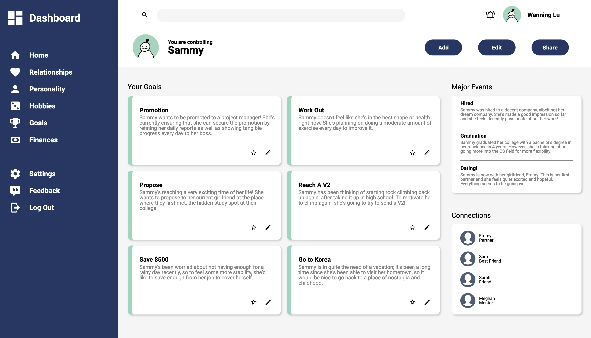

# Dashboard UI

This is my mockup of a dashboard UI, where the concept is one of controlling a Sim. Its layout is built entirely with CSS Grid, including the sidebar, 
header, and the main content that holds the "goals". It is compatible with most desktop screens, though not mobile compatible. 

## Learning Outcomes

☑ Learn CSS Grid
- Implemented CSS Grid for nearly every aspect of the mockup; the sidebar and main content were divided into two columns, whereas the sidebar was a grid in of itself, etc. 
- Used CSS Grid rules for both the parent and child, such as defining the template and using `justify-self`, `align-self`, or `grid-column`