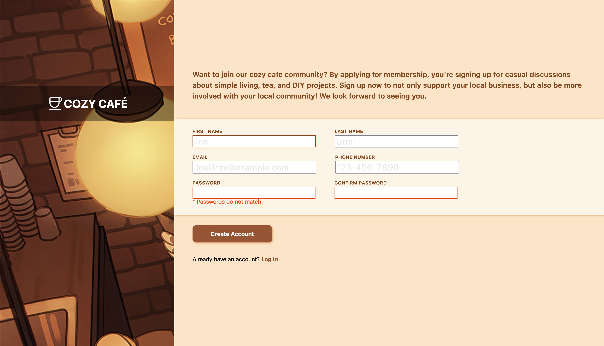
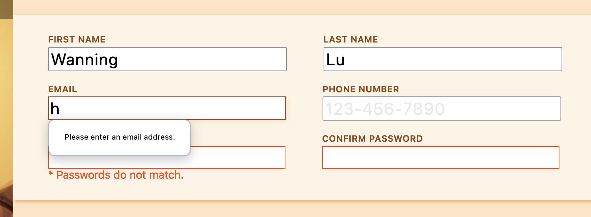
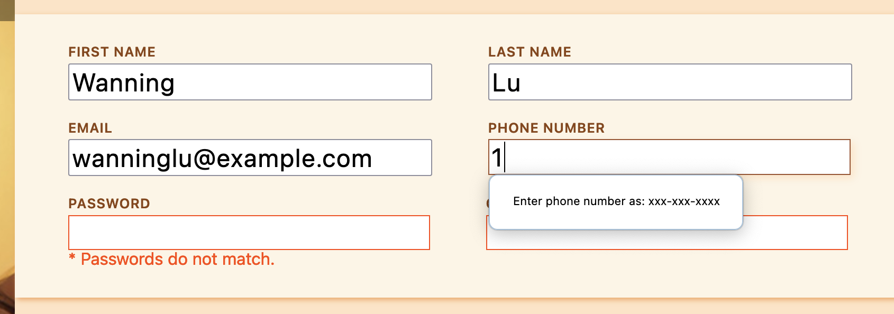
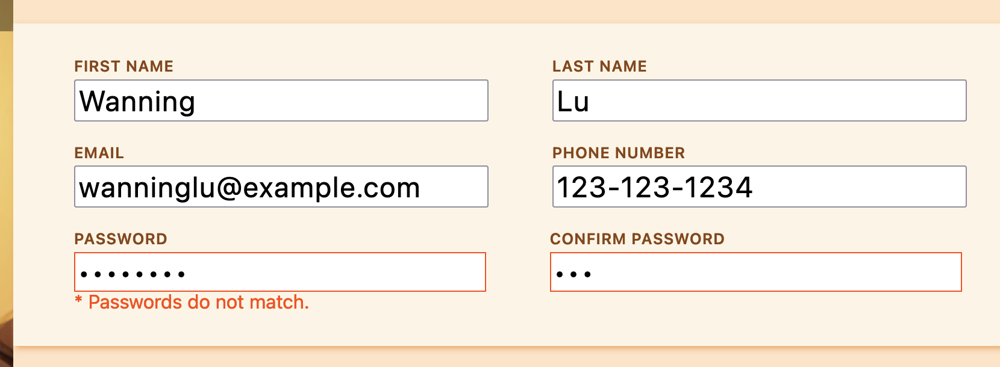
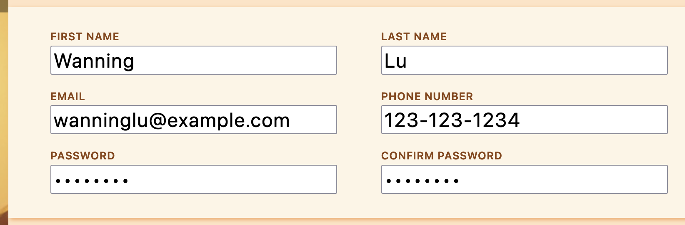

# Sign Up Form Mockup

Welcome to my fictional community, the Cozy Café! Here, I implemented a pure front-end HTML/CSS/slight JS form with some client-side validation baked in. Nothing actually gets changed from the POST request that's sent, but this project is mostly focused on a deeper dive into the power of HTML forms. 

Home page:

*The password confirmation is invalid on default*

Examples of invalid inputs (popups are generated after clicking the "Create Account" button:

*Invalid email*

*Invalid phone number*

*Passwords not matching*

*Every input is valid*

## Learning Outcomes
☑ Learn regular expressions to effectively use the `pattern` attribute for different inputs
- Used pattern matching for phone number validation

☑ Learn how to format forms
- Not only format, but style with the `:invalid` selector
- Increased knowledge of flexbox, as I used flexbox for most of the layout

☑ Use JS to implement password confirmation
- Used simple JS to check the two values of the input boxes against each other every time the input is changed

